# Skillify

**A table of contents for your AI skills — so agents find the right skill instantly, not by reading everything.**

Think of how a book's index works: you don't read 500 pages to find the chapter on "database migrations" — you scan the table of contents, find the page number, and jump straight there. Skillify does exactly this for AI agent skills.

```
Without Skillify:              With Skillify:
┌─────────────────────┐        ┌─────────────────────┐
│ Load ALL skills     │        │ Load the INDEX only │
│ into context        │        │ (names + keywords)  │
│ (bloated prompt,    │        │         ↓           │
│  slow, expensive)   │        │ Search: "deployment"│
│                     │        │         ↓           │
│                     │        │ Load ONLY the match │
└─────────────────────┘        └─────────────────────┘
```

## Why use Skillify?

- **You have a growing collection of AI skills** (SKILL.md files, prompts, runbooks) and agents can't efficiently discover what's available
- **You want on-demand loading** — agents should load only what they need, when they need it
- **You want to visualize** how your skills relate to each other (shared keywords, categories, gaps)
- **You need CI/CD integration** — automatically detect when skills are added, removed, or changed
- **You want one command** that creates or updates the index — idempotent, fast, plugs into any pipeline

```
$ skillify scan ./my-skills/

🔍 Scanning: ./my-skills/
📁 Output: skillify-out/

✅ Found 8 skills

📋 Generating index...
🔗 Building knowledge graph...
🎨 Generating interactive visualization...
🖼️  Generating SVG graph...
📊 Writing report...

✨ Done! Output written to skillify-out/

  skillify-out/
  ├── graph.html          ← open in browser
  ├── graph.svg           ← embed in README or docs
  ├── graph.json          ← query without re-reading files
  ├── skills-index.json   ← structured index for AI agents
  ├── SKILLS_INDEX.md     ← human-readable table of contents
  └── SKILLIFY_REPORT.md  ← insights and connections
```

### Visual Graph

<p align="center">
  
</p>

## Installation

```bash
pip install .
# or
pipx install .
# or with uv
uv tool install .
```

## Usage

### Scan a local directory

```bash
skillify scan ./skills/
skillify scan ./skills/ -o my-output/
skillify scan ./skills/ --patterns "SKILL.md,*.md"
```

### Scan a GitHub repo

```bash
skillify scan github:user/repo
skillify scan https://github.com/user/repo
skillify scan user/repo
```

### Search the index

```bash
skillify search "database migration"
skillify search "testing" --index path/to/skills-index.json
skillify search "api" --limit 5
```

### Terminal visualization

```bash
# Category tree with connections
skillify scan ./skills/ --tree

# Connections table
skillify scan ./skills/ --graph
```

### Run as module

```bash
python -m skillify scan ./skills/
python -m skillify search "deployment"
```

## Output Files

### `skills-index.json` — The Index

The core output. A structured JSON file that AI agents can load to discover skills without reading every file:

```json
{
  "version": "1.0",
  "generated": "2026-08-01T08:55:28Z",
  "total_skills": 8,
  "categories": ["infrastructure", "quality", "security"],
  "skills": [
    {
      "id": "database-migration",
      "name": "Database Migration",
      "description": "Safe database schema migration process with rollback support",
      "keywords": ["database", "migration", "schema", "sql", "rollback"],
      "category": "infrastructure",
      "path": "db-migration/SKILL.md",
      "version": "2.0",
      "author": "dba-team"
    }
  ]
}
```

### `graph.html` — Interactive Visualization

A self-contained HTML file with a D3.js force-directed graph. Open in any browser:

- Node labels always visible (Obsidian-style)
- Click nodes to see skill details and connections
- Search box to highlight matching skills (non-matches fade)
- Category filter checkboxes
- Zoom and pan
- Dark theme with teal accent

### `graph.svg` — Animated SVG

An animated SVG with dark terminal aesthetic — embeddable in GitHub READMEs or docs. Shows the graph with path-highlighting animation between connected skills.

### `graph.json` — The Knowledge Graph

Nodes (skills) and edges (relationships) for programmatic querying:

```json
{
  "nodes": [{"id": "...", "label": "...", "category": "...", "keywords": [...]}],
  "edges": [{"source": "id1", "target": "id2", "type": "keyword", "weight": 3, "shared": ["kw1","kw2","kw3"]}]
}
```

Edge types:
- `category` — Skills in the same category (weight: 1)
- `keyword` — Skills sharing 2+ keywords (weight: number of shared keywords)

### `SKILLS_INDEX.md` — Human-Readable Table of Contents

A markdown table with all skills, descriptions, categories, and keywords. Good for READMEs and documentation.

### `SKILLIFY_REPORT.md` — Analytics Report

Highlights and insights:
- Overview statistics
- Category breakdown
- Key clusters (highly interconnected skills)
- Hub skills (most connected)
- Keyword frequency analysis
- Suggested groupings (skills that could be merged or co-located)
- Isolated skills (potential gaps)

## Skill File Format

Skillify scans for markdown files and extracts metadata. The preferred format uses YAML frontmatter:

```markdown
---
name: Database Migration
description: Safe database schema migration process
category: infrastructure
tags: [database, migration, schema, sql, rollback]
version: "2.0"
author: dba-team
---

# Database Migration

Your skill content here...
```

### Supported frontmatter fields

| Field | Description | Required |
|-------|-------------|----------|
| `name` / `title` | Skill display name | No (falls back to H1 heading or filename) |
| `description` | One-line description | No (falls back to first paragraph) |
| `tags` / `keywords` | Comma-separated or YAML list | No (auto-extracted from content) |
| `category` | Grouping category | No (defaults to "uncategorized") |
| `version` | Skill version | No |
| `author` | Skill author | No |

### No frontmatter? No problem.

Skillify falls back to:
- **Name:** First `# Heading` or filename
- **Description:** First paragraph after heading
- **Keywords:** Auto-extracted via term frequency analysis

## How AI Agents Use the Index

It's the same pattern as a book's table of contents:

| Book | Skillify |
|------|----------|
| Table of contents (titles + page numbers) | `skills-index.json` (names + keywords + paths) |
| Flip to the right chapter | Load only the matching SKILL.md |
| Read just what you need | Inject into agent context, then discard |

Instead of loading all skill files into context:

1. **Load only the index** — lightweight (names + descriptions + keywords)
2. **Search by keyword** — when a task comes in, find the matching skill
3. **Load on demand** — read only the matched skill file
4. **Discard when done** — keep the context window lean

```python
# Example: AI agent skill loading
import json

with open("skillify-out/skills-index.json") as f:
    index = json.load(f)

# Search for relevant skills
query = "database migration"
matches = [s for s in index["skills"] 
           if query in s["description"].lower() 
           or any(query in kw for kw in s["keywords"])]

# Load only what's needed
for skill in matches:
    with open(skill["path"]) as f:
        instructions = f.read()
    # → inject into agent context
```

## Integration with AI Tools

One command to wire skillify into your AI assistant:

```bash
skillify install claude      # creates .claude/skills/skillify/SKILL.md
skillify install codex       # appends to AGENTS.md
skillify install cursor      # creates .cursor/rules/skillify.mdc
skillify install opencode    # appends to AGENTS.md
skillify install kiro        # creates .kiro/skills/skillify/SKILL.md
```

This creates the appropriate config file for your platform, telling the AI to consult the index before starting tasks.

```bash
# Custom index path
skillify install claude --index my-output/skills-index.json

# Install in a different project
skillify install cursor --project /path/to/project

# Remove integration
skillify uninstall cursor
```

### What it generates

Each platform gets a tailored instruction file. For example, `skillify install claude` creates:

```markdown
# Skill Loader

Before attempting any task, check if a relevant skill exists.

1. Read `skillify-out/skills-index.json` to see available skills
2. Search for keywords matching the current task
3. If a match is found, read the skill file at the path specified
4. Follow the skill instructions for that task
```

### Manual setup (any tool)

If your tool is not listed, add this to its instruction/system file:

```
Before starting any task:
1. Read skillify-out/skills-index.json
2. Search for keywords matching the task
3. If found, read the skill at the matched path
4. Follow its instructions
```

## CI/CD Integration

Skillify is designed to plug into any CI pipeline. The `scan` command is idempotent — run it again and it creates or updates the output.

### CI-Friendly Flags

```bash
# Check if index is stale (exit 1 = needs update, exit 0 = current)
skillify scan ./skills/ --check

# Show what changed since last scan, then update
skillify scan ./skills/ --diff

# Machine-readable JSON output for CI logs
skillify scan ./skills/ --json-output

# Skip visuals for faster CI runs (just index + report)
skillify scan ./skills/ --no-html --no-svg

# Combine: fast check with JSON for automation
skillify scan ./skills/ --check --json-output --no-html --no-svg
```

### GitHub Actions

```yaml
name: Update Skills Index
on:
  push:
    paths: ['skills/**']
  pull_request:
    paths: ['skills/**']

jobs:
  update-index:
    runs-on: ubuntu-latest
    steps:
      - uses: actions/checkout@v4
      
      - uses: actions/setup-python@v5
        with:
          python-version: '3.12'
      
      - name: Install skillify
        run: pip install .
      
      - name: Check if index is current
        run: skillify scan ./skills/ --check --no-html --no-svg
        # Fails the job if index is stale
      
      # OR: auto-update and commit
      - name: Update index
        run: skillify scan ./skills/ --diff

      - name: Commit updated index
        run: |
          git add skillify-out/
          git diff --cached --quiet || git commit -m "chore: update skills index"
          git push
```

### GitLab CI

```yaml
update-skills-index:
  stage: build
  script:
    - pip install skillify  # or: pip install ./path-to-skillify
    - skillify scan ./skills/ --diff --no-html --no-svg
  artifacts:
    paths:
      - skillify-out/
  only:
    changes:
      - skills/**/*
```

### JSON Output Format

When using `--json-output`, the output is a structured JSON object:

```json
{
  "total_skills": 9,
  "categories": ["infrastructure", "quality", "security"],
  "output_dir": "skillify-out",
  "files": ["graph.json", "skills-index.json", "SKILLS_INDEX.md", "SKILLIFY_REPORT.md"],
  "diff": {
    "is_stale": true,
    "total_skills": 9,
    "changes": { "added": 1, "removed": 0, "modified": 0, "unchanged": 8 },
    "added_skills": ["Incident Response"],
    "removed_skills": [],
    "modified_skills": []
  }
}
```

For `--check --json-output`:

```json
{
  "is_stale": true,
  "total_skills": 9,
  "changes": { "added": 1, "removed": 0, "modified": 0, "unchanged": 8 },
  "added_skills": ["Incident Response"],
  "removed_skills": [],
  "modified_skills": [],
  "check": "stale"
}
```

## Project Structure

```
skillify/
├── .github/workflows/ci.yml  # GitHub Actions CI
├── .gitignore
├── pyproject.toml          # Package config
├── README.md
├── examples/
│   ├── sample-skills/      # 8 sample SKILL.md files to try
│   └── output/             # Generated output from sample-skills
└── skillify/
    ├── __init__.py
    ├── __main__.py         # python -m skillify support
    ├── cli.py              # Click CLI (scan, search commands)
    ├── scanner.py          # Directory scanner + metadata extraction
    ├── github_scanner.py   # GitHub repo clone + scan
    ├── indexer.py          # JSON + Markdown index generation
    ├── differ.py           # Diff engine (detect added/removed/modified)
    ├── graph_builder.py    # Knowledge graph construction
    ├── visualizer.py       # HTML/D3.js graph visualization
    ├── svg_visualizer.py   # Animated SVG graph (graphify-style)
    ├── terminal_viz.py     # Rich terminal tree/graph rendering
    ├── integrations.py     # Platform install templates (claude, codex, cursor...)
    └── reporter.py         # Markdown report generation
```

## Requirements

- Python 3.10+
- `git` (for GitHub repo scanning)
- Dependencies: click, pyyaml, requests, rich

## License

MIT
